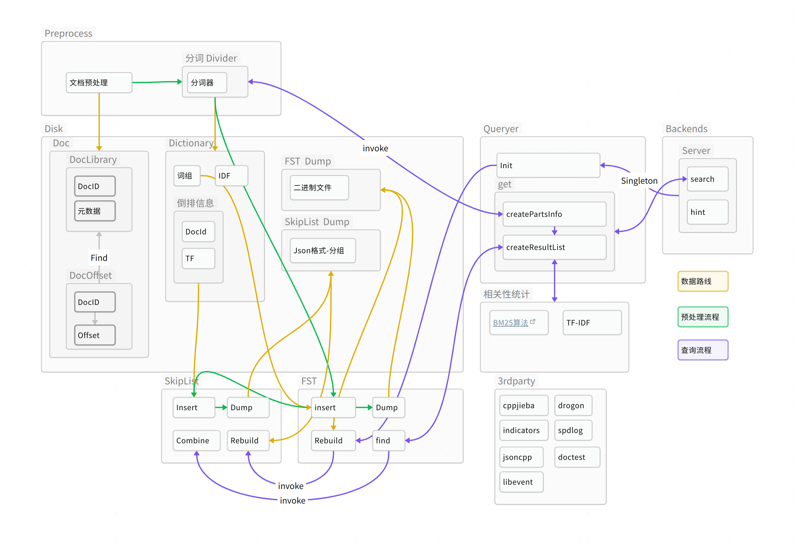

<div align="center">
  <h1>OurSearchEngine</code></h1>

  <p>
    <strong>A simple search engine written in <code>Cpp</code></strong>
  </p>
</div>

## Features
- 


## Architecture



## How to use
### Build
```bash
cd OurSearchEngine
git submodule update --init --recursive
cmake -B build
cmake --build build
```

### Use


## Reference
1. [Lucene](https://www.infoq.cn/article/ejeg02vroegvalw4j_ll)
